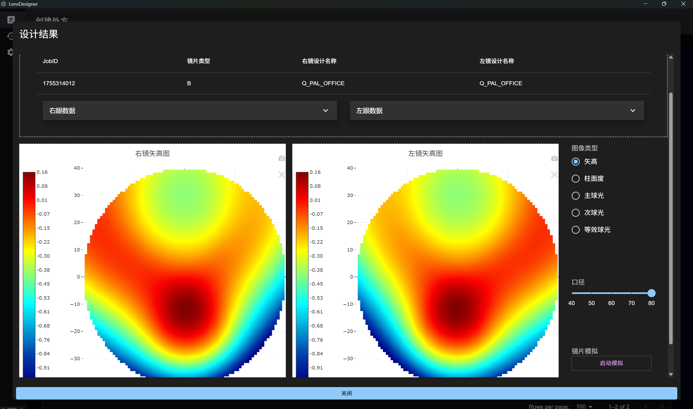
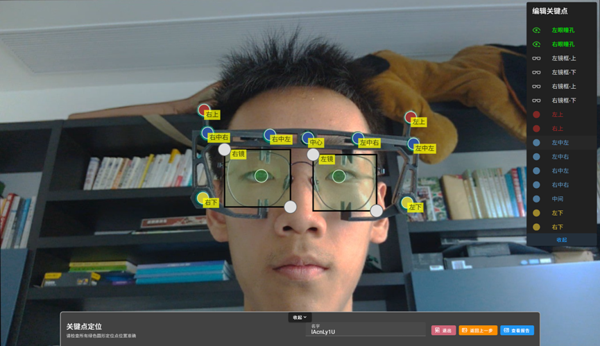
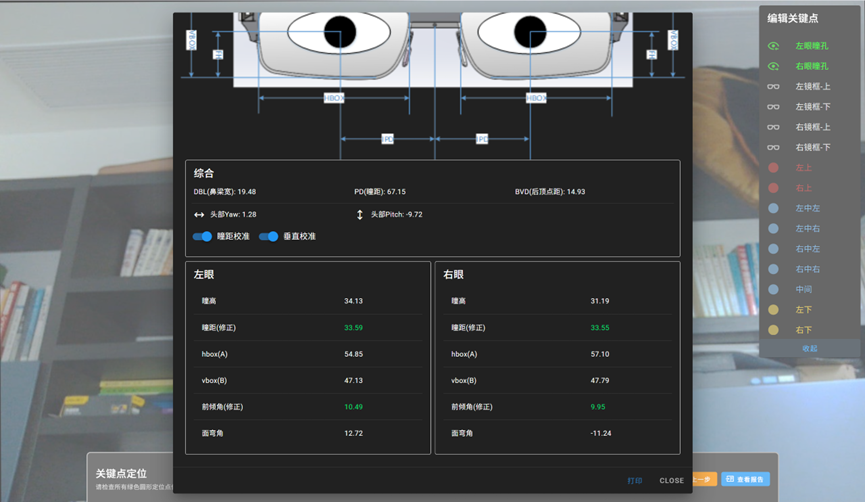
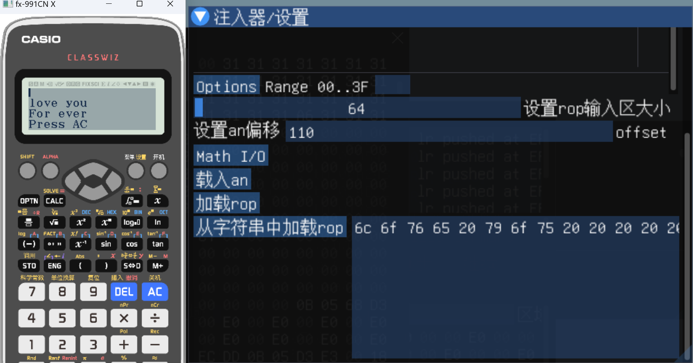

# 💻 Qiu Fuyu
📍 Champaign, IL | 📞 +1 (217) 202-9005 | ✉️ qiufuyutony@gmail.com |  
✉️ fuyuqiu2@illinois.edu  
🔗 [GitHub](https://github.com/qiufuyu123)  
---
## 🎓 Education
1. **University of Illinois Urbana-Champaign (UIUC)** *(2025-now)* — *Freshman student in Computer Engineering*  
(Expected Graduation: 2029)  
2. **Suzhou Foreign Language School (SFLS)** *(2022-2025)*   
---

## 🛠 Technical Skills
- **Languages:** C (proficient), C++(proficient), Python (proficient), Java&C#(familiar), JavaScript(proficient), SQL(familiar)  
- **Frameworks & Tools:** Node.js, MySQL, Nginx, React, Electron, Qt, Avalonia  
- **Development Areas:** Backend services, GUI frameworks, Embedded systems, Reverse engineering  
- **Operating Systems:** Windows, Linux (mainly Ubuntu)  
- **Databases:** MySQL, SQLite, MongoDB  

---

## 💼 Experience

**Software Development Intern** — *Stopto-Optics* | Danyang, Zhengjiang, Jiangsu, China *(June 2025 – now)*  
[Company Home Page](http://www.stopto-optics.com/)

- ⚙️ Developed a **progressive multifocal lens customization & ordering software** for optical retail stores using **React + Electron** (UI) and **Node.js** (backend file synchronization).  
- 📊 Enabled input of personalized vision parameters, automated packaging for computation servers, and generated **visual height maps** for customer display.  
 
- 👓 Built a **lens visualization tool** simulating real-world indoor vision through selected lens models, improving customer experience.
  
- Made a software that can measure people's eyes' parameters from only *one* picture. Based on *YOLOV11* object detection and segmentation to detect glasses and key points on people's face, using a *Detph Camera* to calculate parameters.  
-The algorithm is *patented* in China. (currently in progress)  
  

**Software Engineer (Part-time)** — *Olinteach* | Shanghai, China *(Feb 2025 – April 2025)*  
- 🌐 Designed and implemented an **online foreign teacher booking platform**, help with my colleague integrating scheduling, authentication, and payment.

**Volunteer Developer** — *Consoul-in Mental Health Initiative* | *(2024)*  
- 💬 Built an online **therapist–patient communication platform** supporting remote mental health counseling.  

---

## 🚀 Projects

**A Simple Demoscene** *(2025)*  
- Make a simple demoscene program in less than *4k* bytes size  
- With animated procedural 3D objects, and procedural music  
- Remember to open your speaker when watching the video below  
- [DemoScene Video](https://github.com/user-attachments/assets/6e8abbce-9250-411b-b87a-afb678cf5903)

**AI Based ASD Children Training Research** *(2024)*  
- Use LLM models to generate common living scenes including dialogs and long conversations ( such as dialogs while shopping, taking buses, etc)  
- Make the generated contents as a form of multiple-choice-questions, and assemble them into a mobile program.
- Use the program to train ASD children's reaction to these daily scenes, hoping to help them get involved into the society.
- participate CTB competition
- Original Essay: [Essay PDF](https://github.com/qiufuyu123/qiufuyu123/blob/main/Chatify%20Essay%20.pdf)

**Casio Calculator Reverse Engineering** *(2023)*  
- 🔍 Discovered and exploited a **stack overflow vulnerability** in Casio fx-991CNX, enabling execution of arbitrary code (using the skills called ROP, Return-Oriented-Programing).  
- 📝 Published findings on Zhihu and GitHub, fostering a research community.  
- Documents on Zhihu (a Chinese article sharing platform) are listed below:  
- - [Part 1](https://zhuanlan.zhihu.com/p/618704031)
- - [Part 2](https://zhuanlan.zhihu.com/p/620584634)
- - [Part 3](https://zhuanlan.zhihu.com/p/657962148)
- Github Repository: [Casio Calculator Reverse Engineering](https://github.com/Physics365/991CN-X-CW-Decompilation)
- Simulator Repository: [Casio Calculator Simulator](https://github.com/qiufuyu123/CasioEmuNeo)
  
**Custom x86-64 Operating System** *(2022)*  
- 🖥 Developed from scratch, implementing **VMM**, **VFS**, and multitasking in C.  
- Github Repository: [QNOS](https://github.com/qiufuyu123/qnos)  

**AI Play Edge browser's surf game** *(2025)*
- Make use of Reinforced learning technique, trained a AI model that can play *surf game* (shown below):  
-   
- Github Repository: [Surfbot](https://github.com/qiufuyu123/surfbot)  

**AI Based MBTI personality detector** *(2023)*  
- Use *BERT* language classification network to train a model that can classify users' MBTI personality based on their chatting history.  
- It's a work for [XAcademy](https://www.xacademy.cc/) Hackthon  
- Github Repository: [Chatify](https://github.com/qiufuyu123/Chatify)

**Quick-C Compiler** *(2025)*  
- ⚡ Building a **C-like language compiler** entirely in C, focusing on speed and minimal dependencies.
- [Quick-C Compiler](https://github.com/qiufuyu123/quick-c)
---

## 🏆 Activities & Achievements
- Gold division in USACO  
- 🤖 **VEX Robotics Competition** — Regional First Prize  
- 🤖 **FRC Robotics Competition** — Shanghai Playoff Runner-up, Silver  
